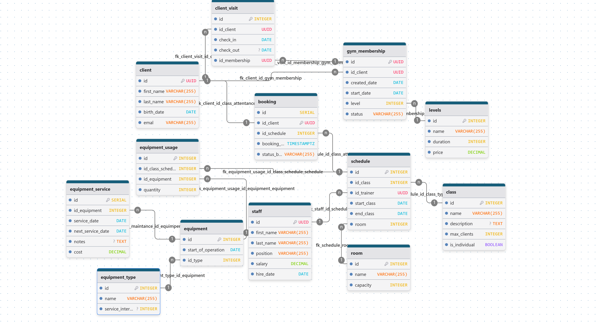

# Описание
## Наименование
Авангард - система для управления фитнес-клубом, онлайн записями, учетом инвентаря.
## Предметная область
Предметная область охватывает управление клиентами и их абонементами, расписанием групповых занятий, персоналом, оборудованием и отслеживание посещений. Ключевая функция — предоставление клиентам удобного веб-интерфейса для записи на занятия и управления своим членством.
# Данные

## Для каждого элемента данных - ограничения

### client - клиенты клуба
|Название поля|Тип|Ограничения|
|:-|:-:|:-|
|id|UUID|PRIMARY KEY|
|first_name|VARCHAR(255)|Отсутствие цифр и специальных символов, NOT NULL|
|last_name|VARCHAR(255)|Отсутствие цифр и специальных символов, NOT NULL|
|birth_date|DATE|Возраст клиента от 16 лет, NOT NULL|
|id_membership|INTEGER|FOREIGN KEY -> gym_membership.id, NOT NULL|
|email|VARCHAR(255)|UNIQUE, NOT NULL|

### gym_membership - членство клуба (абонимент)
|Название поля|Тип|Ограничения|
|:-|:-:|:-|
|id|INTEGER|PRIMARY KEY, AUTOINCREMENT|
|start_date|DATE|NOT NULL|
|expiry_date|DATE|NOT NULL, >= start_date|
|level|INTEGER|FOREIGN KEY -> levels.id, NOT NULL|
|status|VARCHAR(255)|NOT NULL, значения: active, expired,cancelled|

### levels - уровень абонимента
|Название поля|Тип|Ограничения|
|:-|:-:|:-|
|id|INTEGER|PRIMARY KEY, AUTOINCREMENT|
|name|VARCHAR(255)|NOT NULL, значения: пробный, базовый, бизнес,  премиум|
|duration|INTEGER|NOT NULL, >= 1 день|
|price|DECIMAL|NOT NULL, >= 0|

### eqipment - спортивный инвентарь
|Название поля|Тип|Ограничения|
|:-|:-:|:-|
|id|INTEGER|PRIMARY KEY, AUTOINCREMENT|
|start_of_operation|DATE|NOT NULL|
|last_service|DATE|Может отсутствовать|
|id_type|INTEGER|FOREIGN KEY -> equipment_type.id, NOT NULL|
|description|TEXT|Может отсутствовать|

### eqipment_type - тип инвентаря
|Название поля|Тип|Ограничения|
|:-|:-:|:-|
|id|INTEGER|PRIMARY KEY, AUTOINCREMENT|
|name|VARCHAR(255)|NOT NULL, UNIQUE (например: гантель 10 кг, беговая дорожка, велотренажер)|
|service_interval|INTEGER|Может отсутствовать|

### staff - персонал
|Название поля|Тип|Ограничения|
|:-|:-:|:-|
|id|UUID|PRIMARY KEY|
|first_name|VARCHAR(255)|Отсуствие цифр и специальных символов, NOT NULL|
|last_name|VARCHAR(255)|Отсуствие цифр и специальных символов, NOT NULL|
|position|VARCHAR(255)|NOT NULL, значения: тренер, администратор, уборщик, инструктор, мастер|
|salary|DECIMAL|> 0.00|
|hire_date|DATE|NOT NULL|

### client_visit - посещение клиента
|Название поля|Тип|Ограничения|
|:-|:-:|:-|
|id|INTEGER|PRIMARY KEY, AUTOINCREMENT|
|id_client|UUID|FOREIGN KEY -> client.id, NOT NULL|
|check_in|TIMESTAMPZ|NOT NULL|
|check_out|TIMESTAMPZ|>= check_in, NOT NULL|

### class - тренировка
|Название поля|Тип|Ограничения|
|:-|:-:|:-|
|id|INTEGER|PRIMARY KEY, AUTOINCREMENT|
|name|VARCHAR(255)|NOT NULL, UNIQUE (например: йога, пилатесс, кроссфит)|
|description|TEXT|Может отсутствовать|
|max_client|INTEGER|>= 1, может быть нулевым|

### schedule - расписание тренировок
|Название поля|Тип|Ограничения|
|:-|:-:|:-|
|id|INTEGER|PRIMARY KEY, AUTOINCREMENT|
|id_class_type|INTEGER|FOREIGN KEY -> class.id, NOT NULL|
|id_trainer|UUID|FOREIGN KEY -> staff.id, NOT NULL|
|start_class|TIMESTAMPZ|NOT NULL|
|end_class|TIMESTAMPZ|NOT NULL, > start_class|
|room|VARCHAR|NOT NULL|

### equipment_usage - использование инвенторя
|Название поля|Тип|Ограничения|
|:-|:-:|:-|
|id|INTEGER|PRIMARY KEY, AUTOINCREMENT|
|id_class_schedule|INTEGER|FOREIGN KEY -> schedule.id, NOT NULL|
|id_equipment|INTEGER|FOREIGN KEY -> equipment.id, NOT NULL|
|quantity|INTEGER|>= 1|
## Общие ограничения целостности
- *Клиент должен иметь активную подписку для посещения*

    В client_visit проверять, что gym_membership.status = 'active'

- *Нельзя назначить занятие в прошлом*
    
    schedule.start_class ≥ CURRENT_TIMESTAMP

- *Один тренер не может проводить два занятия одновременно*

    Проверка пересечения времён в schedule для одного id_trainer

- *Максимальное количество клиентов в классе*
    
    При записи на занятие проверять: COUNT(client_visit WHERE id_class_schedule = X) < class.max_clients

- *Оборудование должно быть в рабочем состоянии*

    Если last_service + service_interval < CURRENT_DATE — считать оборудование требующим обслуживания

- *Уникальность email*

- *Расписание не может быть без тренера и типа класса*
# Пользовательские роли
- *Клиент*

    Может записываться на занятия, совершать действия над абониментом (покупка, замораживание и т.д.).
    Количество: 100-1000 человек.
- *Тренер*

    Просмотр и управление своим расписанием занятий.
    Количество: 10-20 человек.
- *Администратор*

    Полное управление системой: клиенты, тренера, абонементы, типы занятий, расписания, оборудования.
    Количество: 2-5 человек.
# UI / API 
*UI (Пользовательский интерфейс):*
Публичный сайт (для клиентов): Личный кабинет с расписанием, возможностью записи/отмены занятий.

*API (Интерфейс программирования приложений):*
Фрейморк FastAPI для написания backend.
Встроенный ASGI-сервер Uvicorn.
Frontend будет написан с помощью React. Связь с backend будет осуществляться REST API.
# Технологии разработки
## Язык программирования
Приложение будет написано на языке программирования Python версии 3.10. 
## СУБД
RostgreSQL
# Тестирование
Unit Tests с помощью фреймворка pytest.

Тестирование безопасности, например доступ клиента к возможностям администратора.